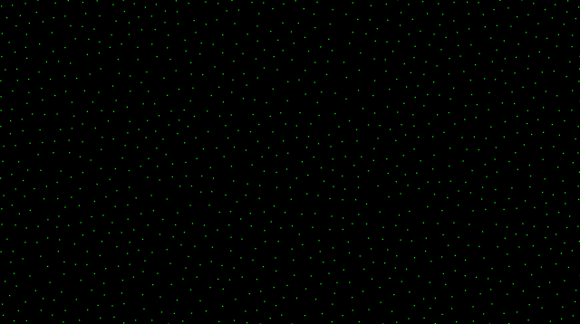

# decluster

This demo uses a custom declustering algorithm to perform a random search for a set of points where each point is separated from all other points by at least the specified minimum distance. It  works on an inital set of randomised 2D points finding and replacing clusters with new random points until it settles on a viable declustered set.

### Basic Usage
```
use decluster::Canvas;

pub fn main() {
    let point_count = 500;
    let min_distance = 58.0;

    Canvas::new(point_count, min_distance).show();
}

```

### Examples
For more notes and a working example please see the decluster_demo example that accompanies this lib. The source for the demo is listed
under the [examples](https://github.com/anderson-international/decluster/tree/master/examples) directory on GitHub.

To compile and run the example use:

```
> cargo run --example decluster_demo --release
```

Once you get it running then have play with the `point_count` and `min_distance` parameters to find the interesting tipping points where viable sets exist but
are increasingly hard to find.

For example with a screen size of [2560, 1440] and a point count of 500 the balance point exists when the minimum distance lies between 55 and 60.
With these numbers there exists a limited set of viable distributions that manage to fit all the points whilst maintaining the specified minimum distance.
As a result you will see the algorithm take its time before eventually settling on a viable distribution. Increasing the minimum distance just a little from here
will increase the difficulty further until eventually no viable solutions exist and the algorithm will cycle.

##### Before - The initial random distribution of points

##### After - A viable set of distributed points where each point is separated by at least the minimum distance


### Basic Usage

```
use decluster::Canvas;

fn main() {
    let point_count = 500;
    let min_distance = 58.0;

    Canvas::new(point_count, min_distance).show();
}

```
